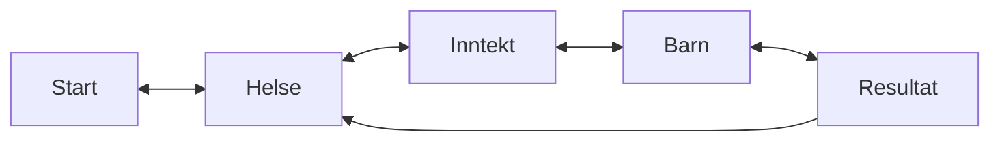
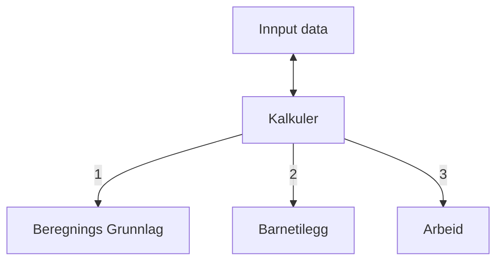

# aap-kalkulator
Vi ser i dag at det er mange henvendelser til NKS hvor brukerne lurer på hvor mye de kan få i AAP, og hvorfor de får akkurat denne summen. Denne kalkulatoren vil kunne gi en forhåndsberegning av AAP til brukere, med en enkel forklaring av hva som ligger til grunn for utregningen. Vi håper kalkulatoren kan redusere noen av henvendelsene til NKS. Vi legger vekt på at kalkulatoren kun er et hjelpeverktøy og ikke en nøyaktig utregning. Den vil ikke kreve innlogging. 

Bruker starter på en startside hvor de blir informert om informasjonene nevt i avsnittet over. Etter et noe spørsmål er blitt besvart vil de bli presentert med resultat siden. Teksten er dynamisk og vil være forskjellig ut fra svarene avgitt. I eksempelet under har bruker oppgitt inntekt, antall barn og sykemeldingsår 2020.
| År | Inntekt |
|------|---------|
| **2017** | 300 000 |
| **2018** | 300 000 |
| **2019** | 500 000 |


# Komme i gang

Hvordan bygge, teste og kjøre koden viss aktuelt.

```bash
npm run dev
# or
yarn dev
```
Åpne [http://localhost:3000](http://localhost:3000) i nettleser for å gå gjennom kalkulatoren

---

# Teknisk beskrivelse
Kalkulatoren er strukturert rundt 5 sider.



[Start](https://github.com/navikt/aap-kalkulator-frontend/blob/main/pages/index.tsx)
--> [Spørsmål](https://github.com/navikt/aap-kalkulator-frontend/tree/main/components/questions)
--> [Resultat](https://github.com/navikt/aap-kalkulator-frontend/blob/main/pages/resultat.tsx)

## Logikk

Kalkuler wrapper state (brukers input) i en type, som inneholder tekst log og resultat per år i kroner.
wrappet state blir da sendt inn i 3 funksjoner som regner Beregningsgrunnlag, evt. Baretilegg og Reduksjon pga. arbeid

---

# Teknisk beskrivelse, inkl. ROS:

Kalkulatoren er tested for WCAG 2.0 A og AA. Dette ble testet med en rekke verktøy, blant annet [W3C Validator](https://validator.w3.org/) og [Lighthouse](https://developers.google.com/web/tools/lighthouse).

Risiko- og Sikkerhetsanalyse kan du finne [her](https://apps.powerapps.com/play/e/default-62366534-1ec3-4962-8869-9b5535279d0b/a/f8517640-ea01-46e2-9c09-be6b05013566?ID=1134) (Krever Tilgang til TryggNok)

Beregningene er basert på [AAP beregningsregler](https://www.nav.no/aap#hvor-mye).
Noen unntak er blitt gjort for å gjøre kalkulatoren lettere å bruke, som f.eks tar den ikke hensyn til andre ytelser som bruker får.

---
# Henvendelser

Spørsmål knyttet til koden eller prosjektet kan stilles som issues her på GitHub

## For NAV-ansatte

Interne henvendelser kan sendes via Slack i kanalen #po-aap-innbygger.

